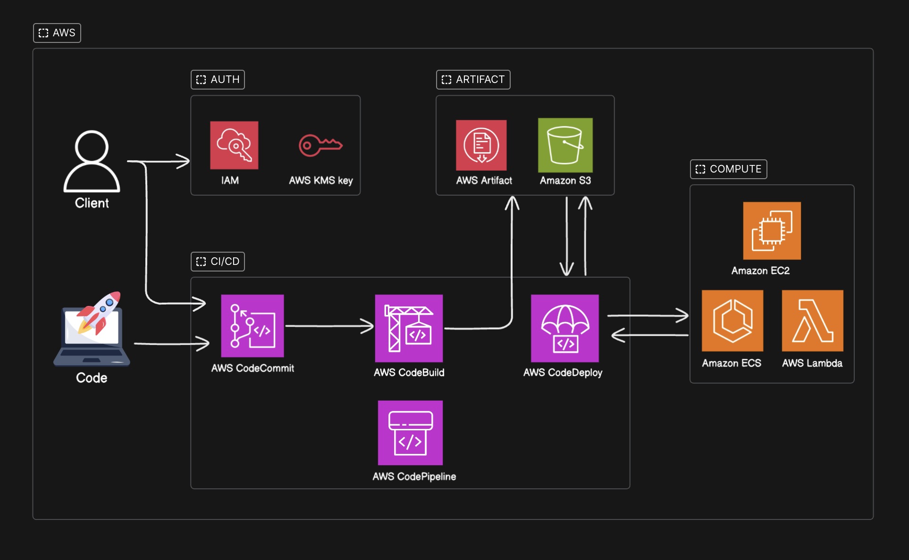
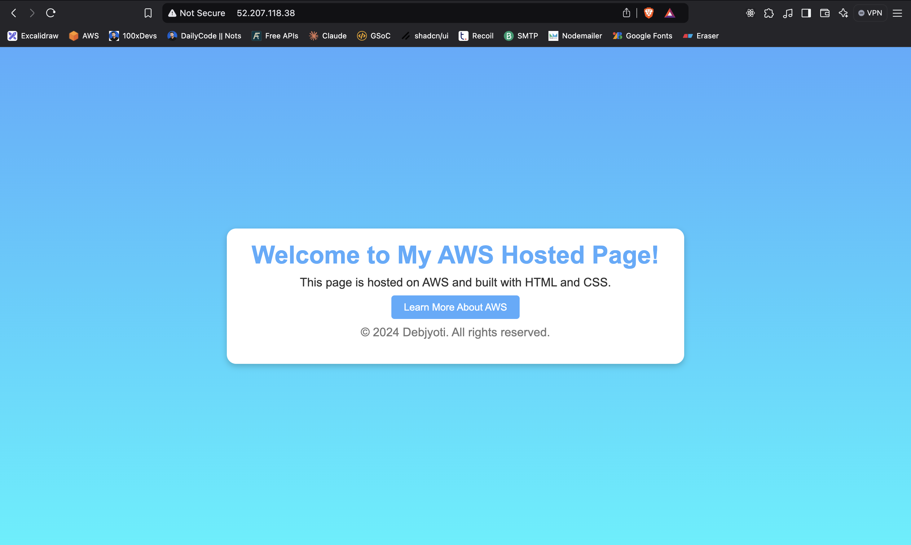
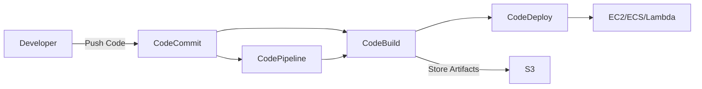

# AWS CI/CD Pipeline Implementation Project 🚀

<div align="center">
  
</div>

<div align="center">
  
  
  
  
  
  
</div>

<div align="center">
  <p style="font-style: italic; color: #666;">
    A robust CI/CD pipeline implementation using AWS native services
  </p>
</div>

## 📋 Table of Contents
<details>
<summary>Click to expand</summary>

- [Project Overview](#project-overview)
- [Architecture](#architecture)
- [Features](#features)
- [Services Used](#services-used)
- [Prerequisites](#prerequisites)
- [Setup and Installation](#setup-and-installation)
- [Pipeline Workflow](#pipeline-workflow)
- [Security](#security)
- [Monitoring and Logging](#monitoring-and-logging)
- [Contributing](#contributing)
- [License](#license)

</details>

## 🎯 Project Overview

```plaintext
Project: AWS CI/CD Pipeline Implementation
Version: 1.0.0
Status: Production Ready
Environment: AWS Cloud
```

## 🏗️ Architecture

<div align="center">
  
</div>



## ✨ Features

```yaml
Core Features:
  - Automated CI/CD Pipeline
  - Multi-Environment Support
  - Security Integration
  - Scalable Architecture
  - Artifact Management

Additional Features:
  - Real-time Monitoring
  - Automated Testing
  - Rollback Capability
  - Audit Logging
```

## 🛠️ Services Used

```json
{
  "version_control": "AWS CodeCommit",
  "build_test": "AWS CodeBuild",
  "deployment": "AWS CodeDeploy",
  "orchestration": "AWS CodePipeline",
  "compute": [
    "Amazon EC2",
    "Amazon ECS",
    "AWS Lambda"
  ],
  "storage": "Amazon S3",
  "security": [
    "AWS IAM",
    "AWS KMS"
  ]
}
```

## 📝 Prerequisites

```bash
# Required Tools
aws --version  # AWS CLI v2.x
git --version  # Git v2.x

# Required Permissions
aws iam list-attached-user-policies --user-name YourUsername

# Required Environment Variables
export AWS_REGION=us-east-1
export PROJECT_NAME=my-cicd-project
```

## 🚀 Setup and Installation

```bash
# 1. Clone Repository
git clone https://git-codecommit.${AWS_REGION}.amazonaws.com/v1/repos/${PROJECT_NAME}

# 2. Configure AWS CLI
aws configure

# 3. Create IAM Roles
aws iam create-role \
    --role-name CodePipelineServiceRole \
    --assume-role-policy-document file://trust-policy.json

# 4. Create CodePipeline
aws codepipeline create-pipeline \
    --pipeline-name ${PROJECT_NAME}-pipeline \
    --cli-input-json file://pipeline-config.json
```

## 🔄 Pipeline Configuration

```yaml
pipeline:
  name: aws-cicd-pipeline
  stages:
    source:
      provider: CodeCommit
      configuration:
        RepositoryName: ${PROJECT_NAME}
        BranchName: main
    
    build:
      provider: CodeBuild
      configuration:
        ProjectName: ${PROJECT_NAME}-build
    
    deploy:
      provider: CodeDeploy
      configuration:
        ApplicationName: ${PROJECT_NAME}
        DeploymentGroupName: production
```

## 🔒 Security Configuration

```json
{
  "Version": "2012-10-17",
  "Statement": [
    {
      "Effect": "Allow",
      "Principal": {
        "Service": "codepipeline.amazonaws.com"
      },
      "Action": "sts:AssumeRole"
    }
  ]
}
```

## 📊 Monitoring and Logging

```python
# CloudWatch Metrics Configuration
monitoring_config = {
    'metrics': [
        'SuccessfulBuilds',
        'FailedBuilds',
        'DeploymentTime',
        'BuildTime'
    ],
    'alarms': {
        'BuildFailure': {
            'threshold': 1,
            'period': 300
        },
        'DeploymentFailure': {
            'threshold': 1,
            'period': 300
        }
    }
}
```

## 🤝 Contributing

```markdown
1. Fork the repository
2. Create feature branch: `git checkout -b feature/YourFeature`
3. Commit changes: `git commit -m 'Add YourFeature'`
4. Push to branch: `git push origin feature/YourFeature`
5. Submit pull request
```

## 📄 License

```plaintext
MIT License

Copyright (c) 2024 Your Name

Permission is hereby granted, free of charge, to any person obtaining a copy
of this software...
```

<div align="center">
  <hr style="width: 50%; margin: 40px auto; border: 1px solid #ddd;">
  <p>Built with ❤️ using AWS Services</p>
  <p style="font-size: 12px; color: #666;">
    Last Updated: January 2024
  </p>
</div>